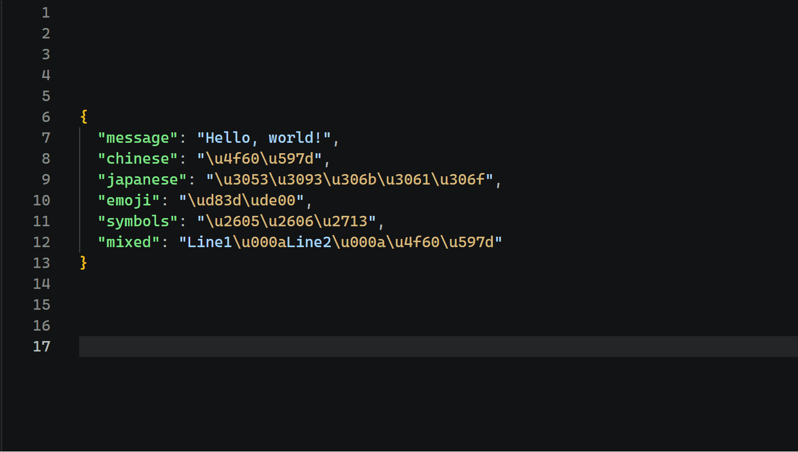

# UCHover

<p align="center">
  <a href="https://marketplace.visualstudio.com/items?itemName=shinku.uchover">
    
  </a>
  
  
</p>

UCHover is a VS Code extension that previews Unicode escape sequences in hover tooltips. It decodes supported escape forms directly from file text and shows the rendered character, its code point, and its Unicode name.

## What it does

- Hover a supported Unicode escape to see the rendered character.
- Decode BMP and astral code points.
- Combine valid UTF-16 surrogate-pair escapes.
- Show a selection preview when you select multiple escapes and hover one of them.



## Supported escape forms

- `\uXXXX`
- `\u{...}`
- `\UXXXXXXXX`
- Adjacent surrogate pairs such as `\uD83D\uDE00`

Examples:

- `\u0041` -> `A`
- `\u{1F600}` -> `😀`
- `\U0001F600` -> `😀`
- `\uD83D\uDE00` -> `😀`

## Hover behavior

When the cursor is inside a supported escape token, UCHover shows:

- the decoded character
- the original escape text
- the Unicode code point
- the Unicode name

Invalid escapes do not produce a hover. Isolated surrogates and out-of-range scalar values are ignored.

## Selection preview

If you select text that contains supported escapes and hover one of those escapes inside the selection, UCHover adds a second hover block with the decoded character sequence.

Selection preview rules:

- only decoded characters are shown
- plain text between escapes is ignored
- valid escapes are decoded in source order
- invalid escapes are skipped

Example selection:

```txt
\u0041 hello \u{1F600}
```

Sequence preview:

```txt
A😀
```

## Development

Requirements:

- Node.js
- pnpm
- VS Code 1.120.0 or newer for the extension host

Useful commands:

```sh
pnpm run compile
pnpm run watch
pnpm test
npm run vsix:package
```

Notes:

- `pnpm run compile` builds the bundled extension into `dist/`.
- `pnpm test` runs the VS Code extension test host. The first run may download the VS Code test binary.
- `npm run vsix:package` uses the project-local `@vscode/vsce` to build a VSIX and avoids relying on a global `vsce` install.

## Project layout

- `src/extension.ts`: extension activation and hover-provider registration
- `src/unicodeHover.ts`: escape parsing, decoding, and hover rendering
- `src/test/extension.test.ts`: parser and extension-host tests
